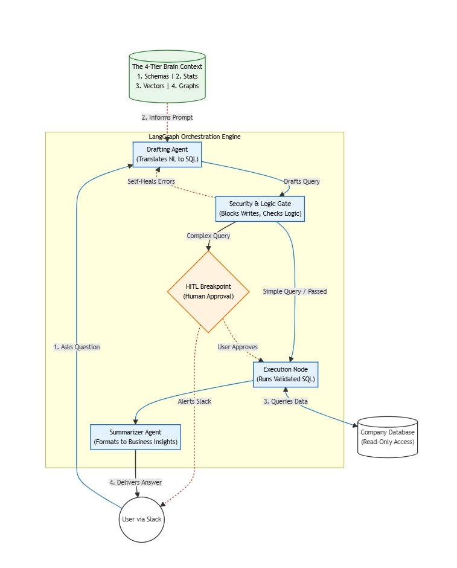

# Autonomous NL2SQL Slack Bot

An enterprise-grade, multi-agent Slack application that translates natural language queries into executable SQL commands. The overarching goal is to allow non-technical team members to query a database securely via Slack, while strictly preventing LLM hallucinations and ensuring enterprise-grade deployment. This system leverages a custom 4-Tier Context Engine (Hybrid RAG) to prevent LLM hallucinations, ensuring highly deterministic and secure database interactions. Engineered with Human-in-the-Loop (HITL) authorization and strict Abstract Syntax Tree (AST) security gating, the bot is deployed via a zero-cost MLOps pipeline on Google Cloud Platform.



## 🏗️ Architecture & Features

This project was built iteratively across four major milestones, progressing from a localized script to a scalable, serverless production environment.

### 1. The 4-Tier Context Engine (Hallucination-Proof RAG)

To guarantee the LLM generates syntactically correct SQL across complex multi-table relationships, standard semantic chunking was abandoned in favor of a deterministic 4-tier architecture:

* **Schema Store:** Hard-coded exact table definitions, column types, and Primary/Foreign Keys.

* **Statistics Store:** Extracted cardinality and top frequent values (e.g., ensuring the LLM filters using exact data representations, like `"SAVE10"` for a coupon code).

* **Vector Store (ChromaDB):** Semantic mapping of natural language concepts (e.g., "inventory") to specific database nomenclature (e.g., `Products` table).

* **Relationship Graph (NetworkX):** A mathematical graph dictating explicit Foreign Key join paths, completely removing the LLM's need to guess how tables connect.

* *Assembler:* A Hybrid RAG engine (Semantic + Lexical exact-match) dynamically synthesizes these 4 pillars into a single, restrictive system prompt payload.

### 2. Multi-Agent Orchestration & Self-Healing

Powered by LangGraph and Groq's `llama3-70b-8192` (operating at a strict Temperature of 0).

* **Drafting Agent:** Consumes the 4-tier context and user query to draft raw SQL.

* **Execution & Validation Node:** Connects to the database and captures native `sqlite3.Error` exceptions.

* **Cyclic Self-Healing:** *Designed architecture allows for future implementation where execution errors automatically route back to the Drafting Agent for correction.*

### 3. Enterprise Security Guardrails

* **AST Hard-Gate (`sqlparse`):** Intercepts the generated SQL string *before* execution. It analyzes the Abstract Syntax Tree, physically blocking any destructive commands (`DROP`, `DELETE`, `UPDATE`, `INSERT`, `ALTER`) regardless of the LLM's output.

* **Data Thresholds:** The AST middleware forcefully appends a `LIMIT 100` clause to all outgoing `SELECT` queries to prevent excessive data egress and compute strain.

### 4. Interactive Slack Integration & HITL

* **Decoupled Webhook (FastAPI + Bolt):** Asynchronously handles Slack `app_mention` events and `interactive_message` block kit payloads.

* **Human-in-the-Loop Breakpoint:** Utilizing LangGraph's `interrupt_before` logic and `MemorySaver`, the graph freezes its state upon generating a query. It sends an interactive Slack message displaying the raw SQL alongside "Approve ✅" and "Deny ❌" buttons. Execution only resumes upon explicit human authorization.

* **Asynchronous UX:** Instantaneous `ack()` responses prevent Slack's strict 3-second timeout window, allowing complex LLM generation to process in background threads.

### 5. Serverless MLOps Deployment (GCP)

Migrated from a local environment to a highly optimized, zero-cost serverless architecture.

* **Containerization:** Packaged via Docker. Optimized container startup by executing embedding generation and schema extraction during the Docker build step.

* **Secrets Management:** API keys (Slack, Groq) injected dynamically at runtime via Google Cloud Secret Manager.

* **Compute (Cloud Run):** Deployed to Google Cloud Run configured with Instance-based ("Always Allocated") CPU to prevent background thread throttling during LLM inference.

* **CI/CD (GitHub Actions):** Automated zero-downtime rollouts. Commits to `main` trigger image rebuilds, Artifact Registry pushes, and Cloud Run revision updates authenticated via GCP Workload Identity Federation.

## 🛠️ Technology Stack

| **Category** | **Technology** | 
| ----- | ----- | 
| **Language & Orchestration** | Python 3.11+, LangChain, LangGraph | 
| **LLM Inference** | Groq (`llama3-70b-8192`) | 
| **Web Framework & API** | FastAPI, Slack Bolt | 
| **Data & Context** | SQLite, ChromaDB, NetworkX, SQLAlchemy | 
| **Security** | `sqlparse` (AST parsing) | 
| **Cloud & MLOps** | Docker, Google Cloud Run, GCP Secret Manager, Artifact Registry, GitHub Actions | 

## 🚀 Usage Example

1. **User:** `@NL2SQL Bot What is the email of the user who bought a Laptop Pro?`

2. **Bot:** *Analyzing database for: 'What is the email of the user who bought a Laptop Pro?' ⏳*

3. **Bot (HITL Alert):**

   > ⚠️ **Approval Required**
   > The AI drafted the following SQL query. Please review it before execution:
   >
   > 
```sql
   > SELECT t1.email FROM Users AS T1 INNER JOIN Orders AS T2 ON T1.user_id = T2.user_id INNER JOIN Products AS T3 ON T2.product_id = T3.product_id WHERE T3.name = 'Laptop Pro' LIMIT 100
```
4. **(User clicks Approve)**


5. **Bot:** Executing query... 🏃‍♂️

6. **Bot:** ✅ Success! Results: alice@example.com

## 📁 Repository Structure

```
├── data/                  # Source SQLite database (ecommerce.db)
├── scripts/               # 4-Tier Brain extraction scripts (Stats, Vector, Graph generation)
├── src/
│   ├── context_assembler.py  # Hybrid RAG payload synthesis
│   ├── sql_agent.py          # LangGraph state definitions and node routing
│   └── main.py               # FastAPI server and Slack Bolt integration
├── chroma_db/             # Local vector store (generated at build time)
├── .github/workflows/     # CI/CD pipeline definition (deploy.yml)
├── Dockerfile             # Container definition and build-time optimization commands
└── requirements.txt       # Managed via `uv`
```

## Future Scope (Phase 2)
* Role-Based Access Control (RBAC): Map incoming Slack User IDs to specific database roles to enforce row-level and column-level security based on organizational hierarchy.

* External Database Migration: Abstract the sandbox SQLite database into a managed cloud instance (e.g., PostgreSQL via Neon or Supabase).
